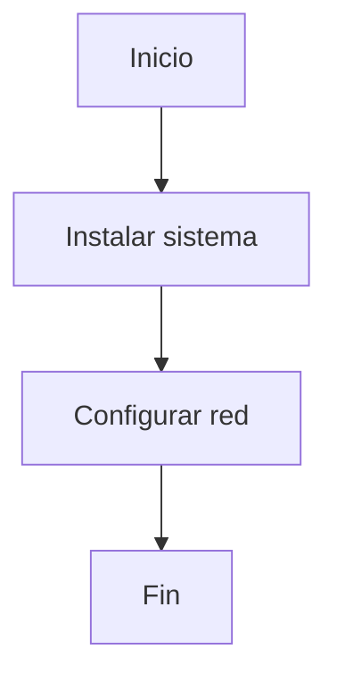

# Documentación Técnica SMR

## Introducción

Esta documentación describe la instalación de un sistema básico.

---

## Requisitos

- Ordenador
- Sistema operativo
- Conexión a red

---

## Diagrama de Flujo

---

## Autor

Nombre del alumno

[//]: # ()
